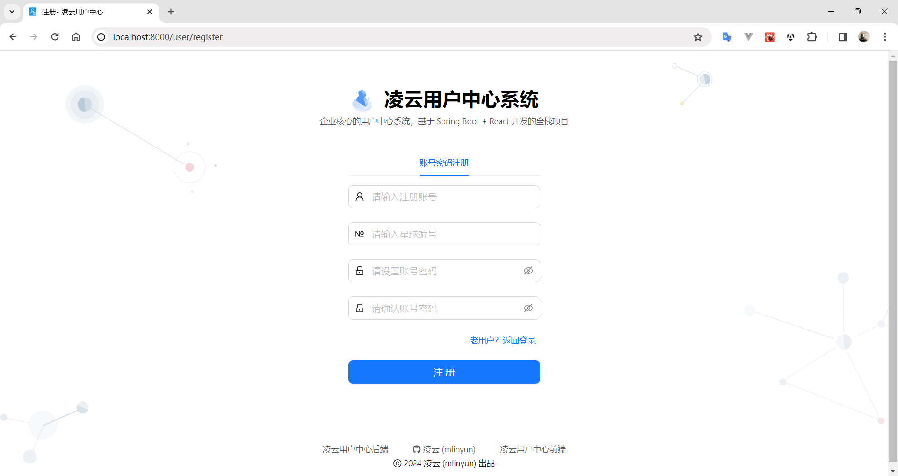
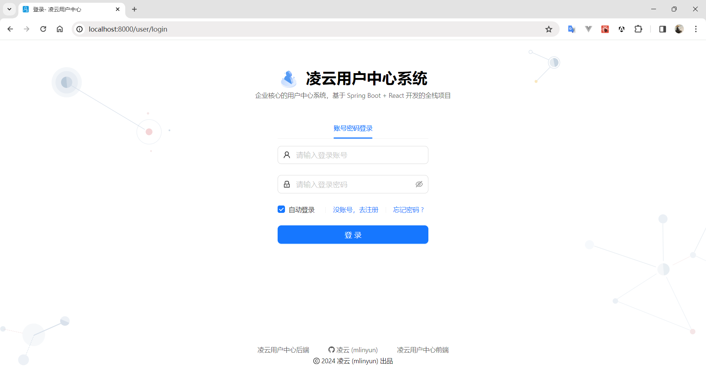
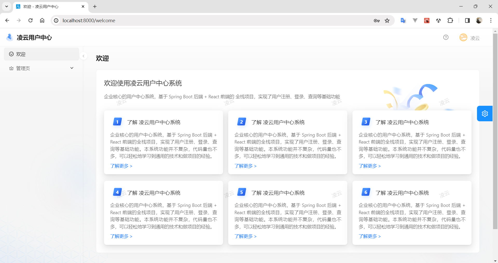
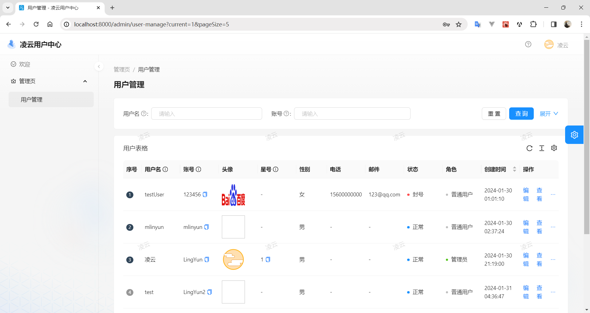

# 用户中心项目

## 项目介绍

企业核心的用户中心系统，基于 Spring Boot 后端 + React 前端的 **全栈项目**，实现了用户注册、登录、查询等基础功能。

## 项目特点

本系统功能并不复杂，代码量也不多，但是正因为如此，大家才不需要关注特定的、复杂的业务流程，可以更轻松地学习到 **通用的技术和做项目的经验**。主要帮助大家轻松学会 **从 0 到 1 独立开发项目** 的方法。

## 详细功能

#### 注册页

#### 登录页

#### 首页

#### 用户管理页

## 技术选型

### 前端

主要使用阿里 Ant Design 生态：

* HTML + CSS + JavaScript 三件套
* React 开发框架
* Ant Design Pro 项目模板
* Ant Design 端组件库
* Umi 开发框架
* Umi Request 请求库
* 正向和反向代理

### 后端

* Java 编程语言
* Spring + SpringMVC + SpringBoot 框架
* MyBatis + Mybatis Plus 数据库访问框架
* MySQL 数据库
* jUnit 单元测试库

### 部署

* Linux 单机部署
* Nginx Web 服务器
* Docker 容器
* 容器托管平台

